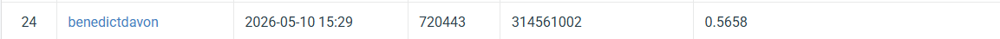
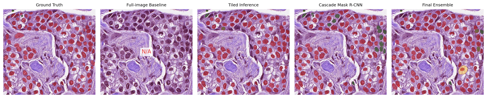
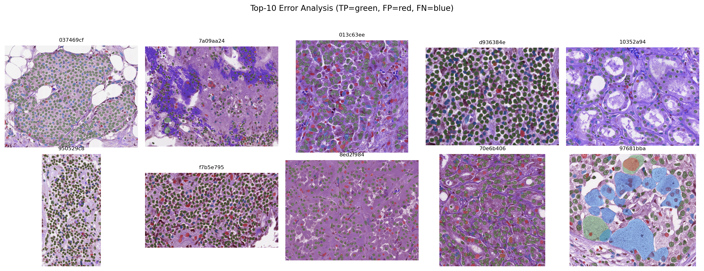

# HW3 Instance Segmentation

Instance segmentation system for **Visual Recognition using Deep Learning HW3**.

The task is to segment individual cell instances from colored medical TIFF images. The final solution uses an MMDetection Mask R-CNN-family pipeline with tile-based training, tile-based inference, Cascade Mask R-CNN, EMA checkpoints, and weighted box fusion.

## Introduction

This repository contains the full code pipeline for HW3 instance segmentation on colored medical images.

Dataset summary:

- 209 labeled training/validation images
- 101 test images
- 4 foreground cell classes: `class1`, `class2`, `class3`, `class4`
- Official metric: AP50

The raw dataset is provided as TIFF images and class-specific TIFF masks. Each unique nonzero pixel value in a class mask represents one object instance. The preprocessing pipeline converts these raw TIFF masks into COCO-style instance segmentation annotations.

Final confirmed public leaderboard score:

```text
Public AP50: 0.5658
```

Final confirmed ensemble:

```text
ens003 = exp020 + exp015 + exp023a

exp020: Cascade Mask R-CNN R50-FPN, epoch 8, weight 1.0
exp015: Mask R-CNN R50-FPN tiled training, epoch 21, weight 1.0
exp023a: Cascade Mask R-CNN R50-FPN with EMA, epoch 10, weight 0.75

Inference: tiled 768x768, overlap 0.25, score_thr 0.03, max_per_img 1000
Merge: class-aware WBF, IoU 0.60
```

## Environment Setup

Use the pinned MMDetection setup in [`docs/ENVIRONMENT.md`](docs/ENVIRONMENT.md).

Create the environment:

```bash
bash scripts/setup_mmdet_env.sh
```

Verify repository readiness:

```bash
conda run -n hw3-mmdet python -m src.training.launch_mmdet --action check
```

Main environment:

```text
Python: 3.10
PyTorch: 2.1.0 + CUDA 11.8
TorchVision: 0.16.0
MMCV: 2.1.0
MMEngine: 0.10.7
MMDetection: 3.3.0
MMPretrain: 1.2.0
Conda env: hw3-mmdet
```

## Usage

### Validate converted assets

```bash
conda run -n hw3-mmdet python -m src.data.validate_mmdet_assets
```

### Check experiment config

```bash
conda run -n hw3-mmdet python -m src.training.launch_mmdet \
  --action check \
  --experiment configs/experiments/exp020_mmdet_cascade_maskrcnn_r50_tile_train_tile_infer.yaml
```

### Runtime smoke test

```bash
conda run -n hw3-mmdet python -m src.training.launch_mmdet --action smoke-train
```

### Train a model

Example: Cascade Mask R-CNN tiled-training branch.

```bash
bash scripts/train_exp.sh \
  configs/experiments/exp020_mmdet_cascade_maskrcnn_r50_tile_train_tile_infer.yaml
```

### Run validation inference

```bash
bash scripts/infer_val.sh \
  configs/experiments/exp020_mmdet_cascade_maskrcnn_r50_tile_train_tile_infer.yaml \
  --checkpoint outputs/runs/exp020_cascade_maskrcnn_r50_tile_train_tile_infer/epoch_8.pth \
  --tile-enabled \
  --tile-size 768 \
  --tile-overlap 0.25 \
  --score-thr 0.03 \
  --max-per-img 1000 \
  --nms-iou-thr 0.5
```

### Run test inference

```bash
bash scripts/infer_test.sh \
  configs/experiments/exp020_mmdet_cascade_maskrcnn_r50_tile_train_tile_infer.yaml \
  --checkpoint outputs/runs/exp020_cascade_maskrcnn_r50_tile_train_tile_infer/epoch_8.pth \
  --tile-enabled \
  --tile-size 768 \
  --tile-overlap 0.25 \
  --score-thr 0.03 \
  --max-per-img 1000 \
  --nms-iou-thr 0.5
```

### Build and validate submission JSON

```bash
conda run -n hw3-mmdet python -m src.export.build_submission \
  outputs/runs/<experiment-folder>/test_release_predictions.segm.json
```

```bash
conda run -n hw3-mmdet python -m src.export.validate_submission \
  outputs/runs/<experiment-folder>/test-results.json \
  --mapping-json data/test_image_name_to_ids.json
```

The generated JSON filename is always:

```text
test-results.json
```

The experiment detail should be stored in the folder name, not in the JSON filename.

## Performance Snapshot

### Main public leaderboard milestones

| Experiment | Public AP50 | Main idea |
|---|---:|---|
| `exp011` | 0.4526 | Class-balanced R50 Mask R-CNN |
| `exp013 / exp011 tile` | 0.5130 | Tiled inference |
| `exp015` | 0.5286 | Tile-only training + tiled inference |
| `exp020` | 0.5378 | Cascade Mask R-CNN R50-FPN |
| `ens001` | 0.5537 | WBF ensemble of `exp020 + exp015` |
| `ens003` | **0.5658** | WBF ensemble of `exp020 + exp015 + exp023a EMA` |

### Public leaderboard progression



### Qualitative comparison



### Error analysis



## Key Findings

The largest improvements came from adapting the pipeline to the dense cell-image structure:

1. Increasing `max_per_img` improved recall on crowded images.
2. Tiled inference gave the first major public leaderboard jump.
3. Tile-only training improved over tiled inference alone.
4. Cascade Mask R-CNN improved the strongest single-model result.
5. EMA and WBF added complementary ensemble gains.

Experiments that were useful but not part of the final confirmed system:

- ConvNeXt-T Mask R-CNN did not replace the R50 anchor.
- R101 COCO-pretrained Mask R-CNN was locally strong but transferred poorly to the public leaderboard.
- All-209 mixed full+tile refit did not improve over the clean tile-only recipe.
- Pseudo-labeling produced only a very small ensemble gain.
- Morphology postprocessing hurt AP/AP75.
- RTMDet-Ins was prepared but limited by memory and driver stability.

